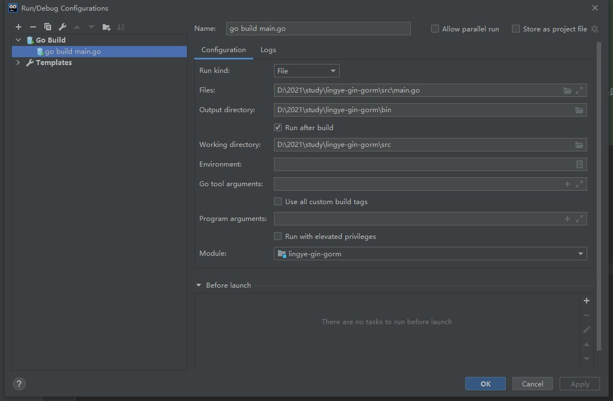

# lingye-gin-grom

#### 介绍
GO + Gin + Gorm + jwt

#### 软件架构
```text
# go版本：1.16.3  -->  from go version
# goland版本：2020.2.4  -->  from https://www.jetbrains.com/go/download/other.html

# bin                       可执行文件执行路径
# doc                       文档、图片等资源
# logs                      日志目录
# src                       源码目录
   - base                   基础结构体
   - config                 
    - application_config.go 配置文件解析配置
    - common.go             全局变量
    - datasource_config.go  数据源配置
    - log_config.go         日志配置
   - dao                    
    - user_dao.go           user's sql
   - entity
    - user.go               user's gorm struct
   - middleware             
    - gin_engine.go         gin配置
    - gin_router.go         路由载入配置
    - jwt_engine.go         jwt配置
    - redis_client.go       redis配置
   - pkg                    第三方依赖包目录
   - rest                   
    - urls.go               路由配置(绑定路径和处理器之间的关系)
   - util
    - util.go               工具类
   - application.yml        主配置文件
   - application-dev.yml    环境配置文件   
   - main.go                应用入口
# go.mod                    依赖说明文件
```

#### 配置Goland
```text
# File | Settings | Go
1、GOROOT
Add SDK...
Local...（这里选择你的Go安装的根路径，我的是"/usr/local/go"）
2、Go Modules
- Enabel Go modules integration打勾
- 
3、Go设置代理
- 查看go 的环境变量 在cmd中 输入go env设置GOPROXY代理：
go env -w GO111MODULE=on
go env -w GOPROXY=https://goproxy.cn,direct
- 设置GOPRIVATE来跳过私有库，比如常用的Gitee，中间使用逗号分隔：
go env -w GOPRIVATE=*.gitee.com
- 如果在运行go mod vendor时，提示Get https://sum.golang.org/lookup/xxxxxx: dial tcp 216.58.200.49:443: i/o timeout，则是因为Go 1.13设置了默认的GOSUMDB=sum.golang.org，这个网站是被墙了的，用于验证包的有效性，可以通过如下命令关闭：
go env -w GOSUMDB=off
- 可以设置 GOSUMDB="sum.golang.google.cn"， 这个是专门为国内提供的sum 验证服务。
go env -w GOSUMDB="sum.golang.google.cn"

# Apply，OK
```

#### 使用说明
- 配置GOPATH
  - Preferences | Go | GOPATH | Project GOPATH
    - add /usr/local/gitee/lingye-gin-gorm/src (这个路径以你本地的路径为准, 这个一定要先配置, 不然执行go mod tidy会找不到依赖)
    - Index entire GOPATH, 打勾
    
- 如果没有go.mod文件, 执行：go mod init lingye-gin
- 执行：go mod tidy, 下载依赖包
- 运行配置


#### 第三方开发文档
```
# gin
https://gin-gonic.com/docs/quickstart/
# gorm
https://jasperxu.com/gorm-zh/
# sql转struct
http://sql2struct.atotoa.com/
```

#### 进度
```text
1、go接入gin(完成)
2、go接入gorm(完成)
3、自定义yaml配置(完成)
4、多库支持(完成)
5、接入日志(完成)
6、接入redis(完成)
7、自定义gin路由(完成)
8、接入jwt(完成)
```